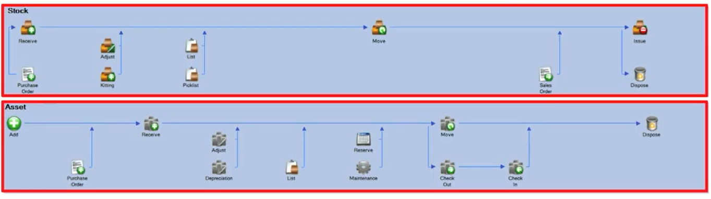

# Weapon module
- dashboard
  - report by number of weapon type registered
- auth
  - [ ] login
  - [ ] logout
  - [ ] [ change password ]
	

- get users information from HR
- personal information about the users
  - photo
  - name
  -  sex
  -  date
  -  region
  -  sub_city
  -  woreda
  -  home_no
  -  birth_place
  -  birth_date
  -  occupation
  -  phone_no
  -  warranty_person [same form]
  - name of provider
  - time limit

- weapon
  - **actors**
  - directorates
    - privileges
      - request weapon
      - request return weapon
      - view their requests and approval
      - don't have 
        - [x] view stored weapon
        - [x] view distributed weapon (only it's own request)
  - MMD
    - privileges
      - notify new weapon
      - request weapon
      - request return weapon
      - view requests and approval
      - view store weapon
      - approve damaged weapon 
  - Weapon div
      - view
  - Weapon store man
      - register new weapon
      - distribute weapon
      - report damaged weapons
      - remove damaged weapons

## major type
  - in mass / single (serial number)

## Notify Weapon
  - type
  - quantity
  - desc
  - attachment
  - date
## register new weapon
  - id
  - itemno in expenditure register
  - no of entry in the registration of incoming goods
  - classification of stack
  - store no
  - shelf no
  - name
  - date
  - from
  - deliverer(doner)
  - deliverer(recipient)
  - total
  ## specific
  - id
  - distribution
  - model
  - serial no
  - quantity
  - unit price
  - total price

## Request Weapon
   - model
   - quantity
   - weapon_name
   - [x] status [pending, approved, rejected]
   - approved [quantity and model / all]
   - approved_by
   - requested_by [directorate]
   - request_date
   - approval_date
   - attachments
     - letters

## Distribute weapon
   - [approved] request
   - user info
   - store man
   - [quantity and model / all]

## Request to return weapon
  - distribution number
  - [quantity and model / all]
  - description
  - attachments
  - approved_by [directorate]

## report damaged weapon
  - model
  - serial number
  - weapon id
  - quantity
  - approved_by
  - status []
  - reported_by
## remove damaged weapon
  - same [distribute]

## ER diagram ??

## pages
### authentication page
  - /auth/login  ----------> for login page
### Admin Page
  - /admin
    - /admin/dashboard [multi-dashboard] ------> 
    - /admin/Notify
      - [ ]  /admin/notify/request
      - [ ]  /admin/notify/list
      - [ ]  /admin/notify/list/{id}
      - [ ]  /admin/notify/list/{id}/edit
      - 
    - /admin/request-weapon
      - [ ]  /admin/request-weapon/list
      - [ ]  /admin/request-weapon/list/{id}
      - [ ]  /admin/request-weapon/list/{id}/edit
      - [ ]  /admin/request-weapon/create
      - [ ]  /admin/request-weapon/return
      - [ ]  /admin/request-weapon/damaged
      - 
    - /admin/inventory
      - [ ]  /admin/inventory/create
      - [ ]  /admin/inventory/list
        - filter [category, date, ...]
      - [ ]  /admin/inventory/list/{id}/edit
      - [ ]  /admin/inventory/list/{id}
      - [ ] /admin/inventory/distribute
    
    - /admin/users
      - [ ] /admin/users
        - [filter, ....]
      - [ ] /admin/users/register
      - [ ] /admin/users/reset-password
  
    - /admin/

-> SMS application
-> user -> forgot-password -> phone number -> 6 digit generate -> application -> send sms -> user enters the 6 digit to provided input
-> [ new password & confirm passoword ]

          ------ 2FA ---------
username, password -> login -> code -> 

--- LOG table
- table name
- request
- created_by
- response
- date

---- Process ---

